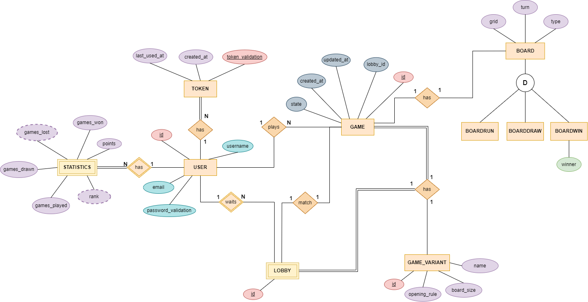

# Gomoku - Backend Documentation

> This is the backend documentation for the Gomoku Royale game.

## Table of Contents

- [Introduction](#introduction)
- [Modeling the Database](#modeling-the-database)
    - [Conceptual Model](#conceptual-model)
    - [Physical Model](#physical-model)
- [Application Architecture](#application-architecture)
- [Critical Evaluation](#critical-evaluation)

---

## Introduction

The backend server is a RESTful API that provides the functionality for the Gomoku Royale board game.
It is written mainly in Kotlin in a JVM gradle project.

The JVM application is a Spring Boot application, built with [Spring Initializr](https://start.spring.io/).

Some used dependencies are:

- **Spring Web** - for the REST API;
- **JDBi** - for the database access, using PostgreSQL;

---

## Modeling the Database

### Conceptual Model

The following diagram holds the Entity-Relationship model for the information managed by the system.

|  |
|:----------------------------------------------------------------------------:|
|                        *Entity relationship diagram*                         |

We highlight the following aspects:

The conceptual model has the following restrictions:

- `User` entity:
    - The `username` and `email` attributes should be unique;
    - The `password` attribute length should be 8-40 characters long;
    - The `username` attribute length should be 5-30 characters long;
    - The `email` attribute needs to follow the following regex pattern: `^[a-zA-Z0-9._-]+@[a-zA-Z0-9.-]+$`.

- `Game` entity:
    - The `state` attribute only accepts the following values: `IN-PROGRESS`, `FINISHED`;
    - The `board` attribute is of type `jsob` and should be a valid `JSON` object;
    - The `updated` and `created` attributes represent the seconds since the [Unix epoch](https://en.wikipedia.org/wiki/Unix_time), and should be greater than 0.
    - The `updated` attribute should be greater than or equal to the `created` attribute;
    - The `host` and `guest` attributes reference the same user;

- `Statistics` entity:
    - The `gamesPlayed`, `gamesWon` and `points` attributes should be greater than 0;
    - The `gamesPlayed` attribute should be greater than or equal to the `gamesWon` attribute;

- `Token` entity:
    - The `created_at` and `last_used_at` attributes represent the seconds since the [Unix epoch](https://en.wikipedia.org/wiki/Unix_time), and should be greater than 0.
    - The `last_used` attribute should be greater than or equal to the `created_at` attribute;

### Physical Model

The physical model of the database is available in [create-schema.sql](../src/sql/create-schema.sql).

To implement and manage the database [PostgreSQL](https://www.postgresql.org/) was used.

The [`code/jvm/src/sql`](../src/sql) folder contains all SQL scripts developed:

- [create-schema.sql](../src/sql/create-schema.sql) - creates the database schema;
- [insert-data.sql](../src/sql/insert-test-data.sql) - adds test data to the database;

We highlight the following aspects of this model:

- **Uniqueness of identifying attributes**: In this database model, attributes that are not primary keys but uniquely
  identify an entity have been marked as unique. This ensures that these attributes maintain their uniqueness throughout
  the data, contributing to data integrity.

- **Choice of Jsonb for the board attribute**: The decision to use the jsonb data type for the `board` attribute in
  the `Game` entity was made after careful consideration. This choice was based on the following factors:
    - **Efficiency of storage and retrieval**: The `board` attribute is the most frequently queried attribute and is
      updated frequently. Using jsonb allows for efficient storage and retrieval of structured data.
    - **Ease of expansion**: Jsonb provides flexibility for future expansion and modification of the `board` structure,
      making it suitable for handling evolving game data.

- **Lobby Entity and Game Configuration**: The decision not to make the `Game` entity weak of the `Lobby` entity and
  instead repeat game configuration attributes was made for efficiency and practicality. The `Lobby` entity serves as a
  storage for the game configuration chosen by a host user. When a user attempts to create a game with a specific game
  configuration that matches an existing entry in the `Lobby` table (where each row represents a user's intention to
  start a game), a new game is created with the same configuration and all game configuration data is transferred to
  the `Game` table. The original `Lobby` row is then deleted to allow another user to create a game with the same
  configuration. This approach simplifies the match-making algorithm, as it only needed to search in the `Lobby` table,
  which is smaller and only contains one row per game configuration combination.

- **Not always using check constraints for data integrity**: Not all restrictions described in the conceptual model have
  been directly implemented using check constraints in the physical model. In cases where certain restrictions might
  evolve or expand in the future, such as the game variants, an entity was created to store the current supported
  values. Additionally, a foreign key was added to the `Game` entity to ensure data consistency and referential
  integrity while allowing for flexibility in adding new supported values.

- **Using epoch seconds for timestamps**: The decision to use epoch seconds for the `created` and `updated` attributes
  was made for efficiency and simplicity. Epoch seconds are easy to work with and are more efficient to store and
  retrieve than other formats.

### Application Architecture

### Critical Evaluation