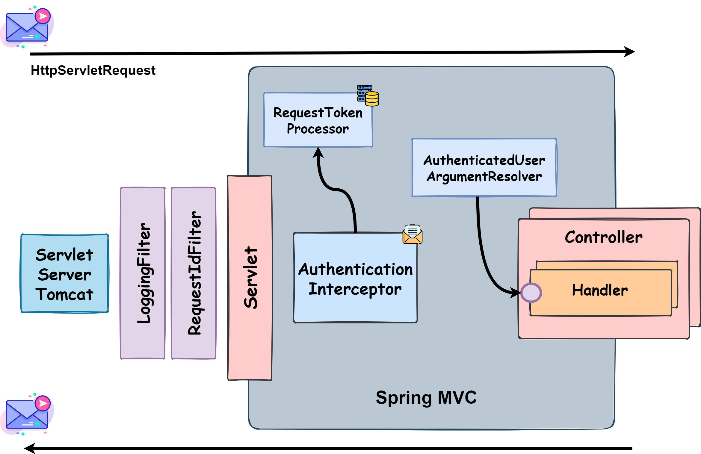

# Gomoku - Backend Documentation

> This is the backend documentation for the Gomoku Royale game.

## Table of Contents

- [Introduction](#introduction)
- [Modeling the Database](#modeling-the-database)
    - [Conceptual Model](#conceptual-model)
    - [Physical Model](#physical-model)
- [Spring MVC Architecture](#spring-mvc-architecture)
- [Application Architecture](#application-architecture)
- [Presentation Layer](#presentation-layer)
- [Service Layer](#service-layer)
- [Data Access Layer](#data-access-layer)
- [Data Representation](#data-representation)
- [Validation](#validation)
- [Error Handling](#error-handling)
- [Implementation Challenges](#implementation-challenges)
- [Further Improvements](#further-improvements)

---

## Introduction

The backend server is a RESTful API that provides the functionality for the [Gomoku](https://en.wikipedia.org/wiki/Gomoku) Royale board game.
It is written mainly in Kotlin in a JVM gradle project.

The JVM application is a Spring Boot application, built with [Spring Initializr](https://start.spring.io/).

Some dependencies used in this project are:

- **[Spring Web](https://spring.io/projects/spring-framework)** - for the REST API; 
- **[Jdbi](https://jdbi.org/)** - for the database access, using PostgreSQL;
- **[Jackson](https://github.com/FasterXML/jackson)** - for JSON serialization and deserialization;

---

## Modeling the Database

### Conceptual Model

The following diagram holds the Enhanced Entity-Relationship (EER) model for the information managed by the system.

|  |
|:----------------------------------------------------------------------------:|
|                    *Enhanced Entity relationship diagram*                    |

We highlight the following aspects:

The conceptual model has the following restrictions:

- `User` entity:
    - The `username` and `email` attributes should be unique;
    - The `username` attribute length should be 5-30 characters long;
    - The `email` attribute needs to follow the following regex pattern: `^[a-zA-Z0-9._-]+@[a-zA-Z0-9.-]+$`.

- `Token` entity:
    - The `created_at` and `last_used_at` attributes represent the seconds since
      the [Unix epoch](https://en.wikipedia.org/wiki/Unix_time), and should be greater than 0.
    - The `last_used` attribute should be greater than or equal to the `created_at` attribute;

- `Statistics` entity:
    - The `games_played`, `games_won`, `games_drawn` and `points` attributes should be greater than 0;
    - The `games_won` and `games_drawn` attributes should be less than or equal to the `games_played` attribute;

- `GameVariants` entity:
    - The `name` attribute should be unique;
    - The `boardSize` attribute should be greater than 0;

- `Game` entity:
    - The `state` attribute only accepts the following values: `IN_PROGRESS`, `FINISHED`;
    - The `board` attribute is of type `jsob` and should be a valid `JSON` object.
    - The `updated_at` and `created_at` attributes represent the seconds since
      the [Unix epoch](https://en.wikipedia.org/wiki/Unix_time), and should be greater than 0.
    - The `updated_at` attribute should be greater than or equal to the `created_at` attribute;
    - The `host_id` and `guest_id` attributes reference the same user;
    - The `lobby_id` attribute has to be unique;

### Physical Model

The physical model of the database is available in [create-schema.sql](../src/sql/create-schema.sql).

To implement and manage the database [PostgreSQL](https://www.postgresql.org/) was used.

The [code/jvm/src/sql](../src/sql) folder contains all SQL scripts developed:

- [create-schema.sql](../src/sql/create-schema.sql) - creates the database schema;
- [insert-data.sql](../src/sql/insert-test-data.sql) - adds test data to the database;

We highlight the following aspects of this model:

- **Uniqueness of identifying attributes**: In this database model, attributes that are not primary keys but uniquely
  identify an entity have been marked as unique. This ensures that these attributes maintain their uniqueness throughout
  the data, contributing to data integrity.

- **Selection of the Jsonb data type for the Board attribute**: The choice to utilize the jsonb data type for the board
  attribute within the Game entity was a deliberate decision shaped by several key considerations:

    - **Efficient storage and retrieval**: Given that the `board` attribute is an abstract entity that can be
      represented
      in different ways by other entites (specialization relation in this case),
      the jsonb data type was chosen to allow for flexibility in the representation of board subtypes.

    - **Ease of representation**: Since the `board` attribute could be represented in different ways, according to the
      game
      state, the jsonb data type was chosen to allow for flexibility in the representation of the board.

- **Lobby entity and game configuration**: The decision to not make the `Game` entity weak of the `Lobby` entity and
  instead repeat the `variant_id` attribute which points to the game configuration, was made for efficiency and
  practicality.
  The `Lobby` entity serves as a user intention to start ame with a specific game configuration. When another user
  attempts to create a game with a specific game
  configuration (represented by the variant id) that matches an existing entry in the `Lobby` table, a new game is
  created with both players instead.
  The host `Lobby` row is then deleted to allow another user to create a game with the same
  configuration. This approach simplifies the match-making algorithm, as it only needed to search in the `Lobby` table,
  which is smaller and only contains one row per game configuration combination instead of the ever-growing `Game`
  table.

- **Not always using check constraints for data integrity**: Not all restrictions described in the conceptual model have
  been directly implemented using check constraints in the physical model. In cases where certain restrictions might
  evolve or expand in the future, such as the game variants, an entity was created to store the current supported
  values. Additionally, a foreign key was added to the `Game` entity to ensure data consistency and referential
  integrity while allowing for flexibility in adding new supported values.

- **Using epoch seconds for timestamps**: The decision to use epoch seconds for the `created_at` and `updated_at`
  attributes
  was made for efficiency and simplicity. Epoch seconds are easy to work with and are more efficient to store and
  retrieve than other formats.

### Spring MVC Architecture

The Spring MVC framework was used to implement the REST API.

|  |
|:------------------------------------------------------------------------------:|
|                       *Spring MVC architecture diagram*                        |

In the above example, the client makes a request to the server, which requires the authentication. The request follows
the pipeline and is handled by the `AuthenticationInterceptor`, which checks if the user is in fact authenticated. In
order to do that, the interceptor uses the `RequestTokenProcessor` to parse the token and validate it based on the token
validation value stored on the database. If the token is valid, the `AuthenticatedUser` information is placed on the
request in order for the `AuthenticatedUserArgumentResolver` to retrieve it and place it on the controller method
parameter. If the token is invalid, the `AuthenticationInterceptor` short-circuits the pipeline and returns an error
response to the client.

For implementation details, please refer to the [/http/pipeline](../src/main/kotlin/gomoku/http/pipeline) folder.

### Application Architecture

|  |
|:--------------------------------------------------------------------------------:|
|                        *Application architecture diagram*                        |

The JVM application is organized as follows:

- [/domain](../src/main/kotlin/gomoku/domain) - contains the domain classes
  of the application ensure data integrity throughout the application;
- [/http](../src/main/kotlin/gomoku/http) - contains the HTTP layer of the application. This layer
  is responsible for handling the HTTP requests and generating the responses, orchestrating the service layer;
- [/repository](../src/main/kotlin/gomoku/repository) - contains the repository layer of
  the application, which provides implementations that can access the database;
- [/services](../src/main/kotlin/gomoku/services) - contains the services that manage the
  business logic of the application and orchestrate the repository layer;
- [/utils](../src/main/kotlin/gomoku/utils) - contains utility classes used by the
  application in all layers, such as the `Either` class which serves as an abstract representation of an
  operation result (either a success or a failure);
- [GomokuApplication.kt](../src/main/kotlin/gomoku/GomokuApplication.kt) - contains the spring boot class
  configuration and
  the entry point of the application.

### [Presentation Layer](../src/main/kotlin/gomoku/http)

The presentation layer is responsible for receiving the requests from the client,
processing them in a way the service layer is expecting,
sending them and returning the responses to the client, using the appropriate
media type.

To represent the data in the requests, several models were created:

- **input models** - used to represent the data in the requests.
- **output models** - used to represent the data in the responses.

This layer is implemented using Spring Web MVC and Spring Validation for input models.

The presentation layer is organized as follows:

- [/controllers](../src/main/kotlin/gomoku/http/controllers) - contains the controllers that handle the HTTP requests
  and generate the responses;
- [/jackson](../src/main/kotlin/gomoku/http/jackson) - contains jackson config used by Spring, and several serializers
  and deserializers used by the application;
- [/media](../src/main/kotlin/gomoku/http/media) - contains the classes that represent the media types used in the
  application such as `application/problem+json`;
- [/pipeline](../src/main/kotlin/gomoku/http/jackson) - contains all interceptors, argument resolvers and request
  processors used by the application before and after the request is handled by the controllers;
- [CustomExceptionHandler](../src/main/kotlin/gomoku/http/CustomExceptionHandler.kt) - contains exception handlers
  that generate the responses for the exceptions thrown by the application;
- [Uris](../src/main/kotlin/gomoku/http/Uris.kt) - object that contains the URIs of the application used by the
  controllers;

### [Service Layer](../src/main/kotlin/gomoku/services)

The service layer is responsible for managing the business logic of the application, receiving the requests from the
presentation layer, processing them, sending them to the data access layer and returning the responses to the
presentation layer.

To represent the result of a service operation, the [Either](../src/main/kotlin/gomoku/utils/Either.kt) class
was created.
This class ensures both the success and failure cases are always represented, which then allows the presentation layer
to generate the appropriate response based on the result of the service operation.

Each service provided by the application does not have an interface because it is not expected to have multiple
implementations of the same service.
In a service, a [TransactionManager](../src/main/kotlin/gomoku/repository/transaction/TransactionManager.kt) is received as a constructor dependency, which then allows the service to manage the transaction scope of the service operation and the underlying data access.

The service layer is organized as follows:

- [UsersService](../src/main/kotlin/gomoku/services/user/UsersService.kt) - manages the requests related to the users;
- [GamesService](../src/main/kotlin/gomoku/services/game/GamesService.kt) - manages the requests related to the games;

Associated with each service package, there are one or more classes that represent the result of the service operation.
Some are defined as typealiases to improve readability.

### [Data Access Layer](../src/main/kotlin/gomoku/repository)

The data access layer is responsible for interacting with the database to persist and retrieve the data.

An interface was created for each entity of the application, which then has an implementation that uses JDBI fluent
api to interact with the database.
Only domain classes can be used in the operations of the data access layer as parameters or return types.

The data access layer is organized as follows:

- [/jdbi](../src/main/kotlin/gomoku/repository/jdbi) - contains the configuration, repository and transaction
  implementations,
  mappers and models that work with Jdbi directly;
- [/transaction](../src/main/kotlin/gomoku/repository/transaction) - contains the transaction abstractions used by the
  service layer to manage the transaction scope of the service operation;
- [UsersRepository](../src/main/kotlin/gomoku/repository/UsersRepository.kt) - exposes the operations related to the
  users;
- [GamesRepository](../src/main/kotlin/gomoku/repository/GamesRepository.kt) - exposes the operations related to the
  games;

### Data Representation

There are types of data representation in the application:

- **Json Models** - which are tied to the JSON representation of the data;
    - **Input Models** - used to represent the data in the HTTP requests;
    - **Output Models** - used to represent the data in the HTTP responses;
- **Jdbi Models** - used to represent the data from the database using the Jdbi interface;
- **Domain Classes** - used to represent the data in the application domain;

To ease the transformation between these models and the domain classes, a few interfaces were created. We hightlight:

- [JsonOutputModel](../src/main/kotlin/gomoku/http/model/JsonOutputModel.kt) - responsible for transforming the domain
  classes into the output models;
- [JdbiModel](../src/main/kotlin/gomoku/repository/jdbi/model/JdbiModel.kt) - responsible for transforming jdbi models
  into the domain classes;

The Json output models are tied to [Jackson library](https://github.com/FasterXML/jackson) while Json input models use
the [Spring Validation Library](https://docs.spring.io/spring-framework/docs/4.1.x/spring-framework-reference/html/validation.html)
to validate the data in the requests.

### Validation

In the backend infrastructure, the validation of the data is done in three different layers:
- **Spring validation**: The Spring validation is responsible for validating the data in the requests, such as the
  request body, path variables, query parameters, etc.
  
  Example: 
  ```kotlin
  data class UserCreationRequest(
      @field:Size(min = 5, max = 30)
      val username: String,
      @field:Email
      val email: String,
      @field:Size(min = 8, max = 30)
      val password: String
  )
  
  // In the controller handler method, the request body is 
  // validated by Spring when @Valid is used.
  @PostMapping
  fun create(@Valid @RequestBody request: UserCreationRequest): ResponseEntity<*> {
      // (...)
  }
  ```

- **Domain Components**: The domain components are responsible for validating the data in the domain classes and ensure data integrity throughout the application.

  Example:
  ```kotlin
  // Component that represents the Id of the user.
  class Id private constructor (val value: Int) : Component {
    companion object {
        // invoke operator allows access to the constructor
        // as if it was public.
        operator fun invoke(value: Int): Either<InvalidIdError, Id> = when {
            value <= 0 -> Failure(InvalidIdError.InvalidId)
            else -> Success(Id(value))
        }
    }
  }
  
  // In the http layer, before calling the service 
  // which is expecting a Id object, the id is validated.
  val id: Either<InvalidIdError, Id> = Id(id)
  when (id) {
      is Either.Right -> service.get(id = id.value)
      is Either.Left -> when(id.value) {
          is InvalidIdError.InvalidId -> // handle error
      }
  }
  ```
  
- **Database**: The database is responsible for validating the data integrity of the data stored in the database.
  This is done by defining constraints on the database schema, such as primary keys, foreign keys, unique constraints,
  check constraints, etc.

### Error Handling

To handle errors/exceptions, we implemented
the [CustomExceptionHandler](../src/main/kotlin/gomoku/http/CustomExceptionHandler.kt) class, which is annotated
with `@ControllerAdvice`, and is responsible for intercepting the harder to detect errors that occur in the
application and generating the appropriate response.

As mentioned before, the [Either](../src/main/kotlin/gomoku/utils/Either.kt) class is used to
represent the result of a service operation.
Which then the presentation layer can generate the appropriate response
based on the result type of the service.

Example:

```kotlin
// service returns:
Either<UserCreationError, Board>

// controller receives the result and evaluates it:
return when (result) {
    // Success
    is Either.Right -> ResponseEntity.status(HttpStatus.CREATED).body(result.value)
    // Failure
    is Either.Left -> when (result.value) {
        is UserCreationError.UsernameAlreadyExists -> Problem(
            type = "https://example.com/probs/user-already-exists",
            title = "User already exists",
            status = 400,
            detail = "The username provided already exists",
            instance = "https://example.com/users/"
        ).toResponse()
        // (...) other errors
    }
}
```

To represent an error in the presentation layer, the media type chosen was `application/problem+json`, which is a
standard
media type for
representing errors in HTTP APIs.
The [RFC 7807](https://tools.ietf.org/html/rfc7807) defines the standard for this media type.

It consists of:

- **type** - a URI reference that identifies the problem type;
- **title** - a short, human-readable summary of the problem type;
- **status** - the HTTP status code generated by the origin server for this occurrence of the problem;
- **detail** - a human-readable explanation specific to this occurrence of the problem;
- **instance** - a URI reference that identifies the specific occurrence of the problem;

### Implementation Challenges

- **Database design**: Finding the best way to represent the data in the database was a challenge.
  We had to consider the data integrity, the performance and the flexibility of the database, and was no easy
  task to find the best balance between these aspects.
- **Abstracting code**: We tried to abstract the code as much as possible, using interfaces, abstract classes and
  generics, to make the code more reusable and easier to maintain. But sometimes we lacked the knowledge to abstract the
  code in a better way.
- **The concurrency problem**: Since the application will run later in a distributed environment, which means that
  multiple instances of the application will be running at the same time, we needed to ensure that the application was
  thread-safe. However, finding the best way to ensure that the application was thread-safe was a challenge.

### Further Improvements

- **Improve logging system**: We only implemented the basic logging for the application, but we could improve the
  logging by
  adding more information to the logs, such as given each request a unique id, and then log the id in each log message.
- **Siren media type**: The Siren media type is a hypermedia type that allows the client to navigate through the
  API and discover the available resources.
  We didn't have the time to implement this media type,
  but it would be a great improvement for the next phase of the project where we will implement the frontend.
- **More variants**: We only implemented the standard variant of the game.
  It would make the application more interesting if we implemented more variants of the game, and give more options
  to the users to choose from.
- **Add more tests**: We only implemented the basic tests for the application, but we could add more tests to improve
  the code
  coverage and ensure that the application is working as expected in all scenarios.
- **Support more operations**: We plan to add more service operations to further enhance the application functionality.
  However, we will make sure that the new services are backward compatible with the existing ones, so we can add new
  features without breaking the existing ones.
