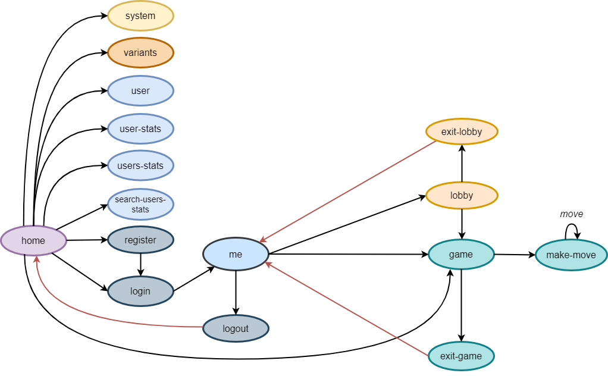

# Gomoku - API Documentation 🉐

> This document contains the HTTP API documentation required for a frontend client application to use this API.

> **Note**: This documentation does not contain any information about the internal backend implementation. To learn more
> about the backend implementation, please refer to the [backend documentation](../code/jvm/docs/README.md).

## Table of Contents

- [Introduction](#introduction)
- [Functionality](#functionality)
- [Media Types](#media-types)
- [Navigation Graph](#navigation-graph)
- [Requests](#requests)
    - [User](#user)
    - [Game](#game)
- [Responses](#responses)
- [Usage Examples](#usage-examples)
    - [User Creation](#user-creation)
    - [User Login](#user-login)
    - [User Logout](#user-logout)
    - [Game Creation](#game-creation)
    - [Game Move](#game-move)
    - [Pagination](#pagination)

---

## Introduction

This API is a RESTful API that is designed to be consumed by a frontend client application.

## Functionality

The API provides the following functionality:

- Creating games, leaving games and matchmaking;
- In-game actions, such as placing pieces on a board;
- User authentication;
- Consult user/s statistical information.

## Media Types

The API uses the following media types:

- `application/vnd.siren+json` - [Siren](https://github.com/kevinswiber/siren) for the API response bodies;
- `application/problem+json` - [RFC7807](https://tools.ietf.org/html/rfc7807) problem details for the API responses in
  case of errors;
- `application/json` - for the API request bodies;

It was added some properties to the siren representation of the resources:
> **Recipe Links**:
> To the API responses using siren was added the property `recipeLinks` to indicate the available resources of the API.

> **Require Auth**:
> To the API responses using siren was added the property `requireAuth` to indicate if the resource requires authentication
> or not. 

### Link Relations

The API uses the following [link relations](https://www.iana.org/assignments/link-relations/link-relations.xhtml) represented in the file [Rels.kt](../code/jvm/src/main/kotlin/gomoku/http/Rels.kt):
- Every link relation that is undocumented in the previous link is a custom link relation created by the API. Every link is represented as an uri with the following format: 
`https://github.com/isel-leic-daw/2023-daw-leic51d-14/tree/main/code/jvm/docs/rels/{resource}`.
  - `self` - the link to the current resource;
  - `user` - the link to the user resource;
  - `game` - the link to the game resource;
  - `system-info` - the link to the system information resource;
  - `user-stats` - the link to the user stats resource;
  - `users-stats` - the link to the users stats resource;

- In the section created for represent the available resources of the API, the link relation is represented as an uri with the following format:
`https://github.com/isel-leic-daw/2023-daw-leic51d-14/tree/main/code/jvm/docs/rels/{resource}/{resource}`.
  - `/users/{user_id}` - the recipe to the user resource;
  - `/games/{game_id}` - the recipe to the game resource;
  - `/games/variants` - the recipe to the game variants resource;
  - `/lobbies/{lobby_id}` - the recipe to the lobby resource;
  - `/users/stats/search?q={query}{&page,itemPerPage}` - the recipe to the users stats resource;
  - `/users/{user_id}/stats` - the recipe to the user stats resource;
  - `/users/stats?q={query}{&page,itemPerPage}` - the recipe to the users stats resource;
  - `/users` - the recipe to the users resource;
  - `/login` - the recipe to the login resource;
  - `/users/logout` - the recipe to the logout resource;
  - `/games` - the recipe to the games resource;
  - `/users/home` - the recipe to the user home authenticated (me) resource;

## Navigation Graph

|  |
|:----------------------------------------------------------:|
|                    **Navigation Graph**                    |

## Requests

Information about the requests:

- For endpoints marked with 🔒 (indicating authentication is required):
    - Include an `Authorization` header using the `Bearer` scheme, with the user's `token`.
  - If the request is done by a browser-based client, the browser will send cookies automatically with each request.
    Supported browsers: `Chrome, Firefox, Safari`.
- For endpoints marked with 📦 (indicating a request body is required):
    - Include a request body with the required information.
    - Ensure the `Content-Type` header is set to `application/json`.
- For endpoints marked with 📖 (indicating the response is paginated):
    - Include the following optional query parameters:
        - `page` - the page number (defaults to `1`);
        - `itemsPerPage` - the number of items per page (defaults to `10`);
- All endpoints should be prefixed with `/api`.

### Home

The API provides the following operations/resources related to the `Home` entity:

- `GET /api/` - returns the home page information and the available resources of the API; See [Home](#home) for more
  information.

### User

The API provides the following operations/resources related to the `User` entity:

- `POST /api/users 📦` - creates a new user; See [User Creation](#user-creation) for more information;
- `POST /api/users/token 📦` - authenticates a user; See [User Login](#user-login) for more information;
- `POST /api/users/logout 🔒` - invalidates a user's token; See [User Logout](#user-logout) for more information;
- `GET /api/users/home 🔒` - returns logged-in user's information;
- `GET /api/users/{id}` - returns the user with the given id; See [Get User](#get-user-by-id) for more information;
- `GET /api/users/stats 📖` - returns the users statistic information by ranking; See [Pagination](#pagination) for more
  information.
- `GET /api/users/{id}/stats` - returns the user statistic information with the given id.
  See [Get User Stats](#get-user-stats) for more information.

### Game

The API provides the following operations/resources related to the `Game` entity:

- `POST /api/games 🔒📦` - joins a lobby or creates a new game with the given variant id;
  See [Game Creation](#game-creation)
  for more information;
- `GET /api/games/{id}` - returns the game with the given id;
- `DELETE /api/games/{id}` 🔒 - deletes the game with the given id;
- `GET /api/system` - returns the system information;
- `POST /api/games/{id}/move 🔒📦` - makes a move in the game with the given id; See [Game Move](#game-move) for more
  information;
- `POST /api/games/{id}/exit 🔒` - exits the game with the given id.
- `GET /api/games/lobby/{id} 🔒` - Checks the status of the lobby with the given ID, returning whether the user is still
  waiting in the lobby or has already entered a game.
- `DELETE /api/games/lobby/{id} 🔒` - deletes the lobby with the given id.

### Responses

Information about the responses:

- All responses have a `Request-Id` header with a unique `UUID` for the request, used for debugging purposes. Also, if
  someone reports a bug in the future, this header can be used to identify the request.
- All responses have a `Content-Type` header with the media type of the response body.

## Usage Examples

### Home Page
- The client application makes a `GET` request to the `home` resource;
- It was created a new property to the siren representation of the home page, called `recipes`, which contains the
  available resources of the API;
- The API then returns a `200 OK` response with the home page information and the available resources of the API in the
  response body. The response body contains the following properties:
    - `recipes` - the available resources of the API;
    - `actions` - the available actions of the API;
    - `entities` - the available entities of the API.

  Example:
  ```json
  {
    "class": [
        "home"
    ],
    "properties": {
        "message": "Welcome to Gomoku API."
    },
    "links": [
        {
            "rel": [
                "self"
            ],
            "href": "/api/"
        }
    ],
    "recipeLinks": [
        {
            "rel": [
                "https://github.com/isel-leic-daw/2023-daw-leic51d-14/tree/main/code/jvm/docs/rels/users/home"
            ],
            "href": "/api/users/home"
        },
        {
            "rel": [
                "https://github.com/isel-leic-daw/2023-daw-leic51d-14/tree/main/code/jvm/docs/rels/users"
            ],
            "href": "/api/users"
        },
        //... More recipes
    "requireAuth": [
        false
    ],
  ```

### User Creation

- The client application makes a `POST` request to the `register` resource, with the **user's credentials** in the
  request
  body. The request body should be a JSON object with the following properties:
    - `username` - the user's username (must be between `5 and 30 characters` long);
    - `email` - the user's email (must follow the following regex: `^[a-zA-Z0-9._-]+@[a-zA-Z0-9.-]+$`);
    - `password` - the user's password (must be between `8 and 40 characters` long);

  Example:
  ```json
  {
    "username": "postman-user",
    "email": "email@validemail.com",
    "password": "postman-password"
  }
  ```
  - The API then:
- **On Success** - creates a new user with the provided credentials and returns a `201 Created` response with the **user representation**
    in the body using siren.

  Example:
  ```json
  {
      "class": [
        "user",
        "login"
      ],
        "properties": {
          "id": 8
        },
      "links": [
      {
          "rel": [
            "https://github.com/isel-leic-daw/2023-daw-leic51d-14/tree/main/code/jvm/docs/rels/user"
          ],
          "href": "/api/users/8"
      },
      {
          "rel": [
          "self"
          ],
            "href": "/api/users/token"
          }
      ],
      "recipeLinks": [],
      "actions": [
          {
          "name": "login",
          "href": "/api/users/token",
          "method": "POST",
          "type": "application/json",
          "fields": [
            {
            "name": "username",
            "type": "text",
            "value": null
            },
          {
              "name": "password",
              "type": "text",
              "value": null
          }
      ],
        "requireAuth": [
          false
        ]
        }
      ],
      "entities": [],
      "requireAuth": [
        false
      ]
  }
  ```
  - **On Failure Example** - returns a `400 Bad Request` response with a message in the response body.

    Example:
    ```json
    {
       "type": "https://github.com/2023-daw-leic51d-14/code/jvm/docs/problems/insecure-password",
       "title": "Received password is considered insecure",
       "status": 400,
       "detail": "Password length must be between 8 and 40 characters",
       "instance": "/api/users"
    }
    ```

### User Login

- The client application makes a `POST` request to the `login` resource, with the user's credentials in the request
  body. The request body should be a JSON object with the following properties:
    - `username` - the user's username (must be between `5 and 30 characters` long);
    - `password` - the user's password (must be between `8 and 40 characters` long).

  Example:
    ```json
    {
        "username": "postman-user",
        "password": "postman-password"
    }
    ```

  - The API then:
- **On Success** - authenticates the user and returns a `200 OK` response with a message in the response body. The
  response body
  contains the following properties:
    - `token` - the user's access token should be used in the `Authorization` header with
      the `Bearer` scheme for all the requests that require authentication.

  Example:
  ```json 
  {
      "class": [
        "token",
        "user"
      ],
      "properties": {
        "token": "CgiEG9OLlaTzEszVtfE2HdBBqqzzThKaao1k5-oCuTg="
      },
      "links": [
          {
              "rel": [
                "self"
              ],
              "href": "/api/users/token"
          }
      ],
      "entities": [
          {
              "properties": {
                  "id": {
                    "value": 7
                  },
                  "username": {
                    "value": "postman-username9"
                  },
                  "email": {
                    "value": "example@postman.com9"
                  },
                  "passwordValidation": {
                    "validationInfo": "$2a$10$S3GqqaONiRlLcAl/RdcD0OaamudMP5qf4SFlcLOPzh/1HSaY1LiaC"
                  }
              },
              "links": [
                  {
                  "rel": [
                    "self"
                  ],
                    "href": "/api/users/7"
                  }
              ],
                  "rel": [
                    "https://github.com/isel-leic-daw/2023-daw-leic51d-14/tree/main/code/jvm/docs/rels/user"
                  ]
          }
      ],
      "requireAuth": [
        false
      ]
  }
  ```
  - **On Failure Example** - returns a `400 Bad Request` response with a message in the response body.

    ```json
    {
       "type": "https://github.com/2023-daw-leic51d-14/code/jvm/docs/problems/invalid-username",
       "title": "Invalid username",
       "status": 400,
       "detail": "The username <postman-user> is invalid",
       "instance": "/api/users/token"
    }
    ```

- The client application should store the user token in a secure place, such as the browser's local storage or a
  cookie.

### User Logout

- The client application makes a `POST` request to the `logout` resource, with the user token in the `Authorization`
  header with the `Bearer` scheme;
  - The API then:
      - **On Success** - invalidates the user's token and returns a `200 OK` response with a message in the response body.

        Example:
        ```json
        { 
           "message": "User was logged out successfully."
        }
        ```

  - **On Failure Example** - returns a `401 Unauthorized` response with a message in the response body.

      Example:
      ```json
      {
          "class": [
              "logout"
          ],
          "properties": {
              "message": "User logged out successfully, token was revoked."
          },
          "links": [
              {
                  "rel": [
                      "self"
                  ],
                  "href": "/api/users/logout"
              }
          ],
        "recipeLinks": [],
        "actions": [],
        "entities": [],
        "requireAuth": [
          true
        ]
     }

- To log in again, the client application should request a new token to the API.

### Get User By Id

- The client application makes a `GET` request to the `users/{id}` resource, with the user id in the request path;
  - The Api then:
      - **On Success**
  - returns a `200 OK` response with the user information in the response body.
    The response body
    contains the following properties:
      - `id` - the user's id;
      - `username` - the user's username;
      - `email` - the user's email;

    Example:
    ```json
    {
        "class": [
            "user"
        ],
        "properties": {
            "id": {
                "value": 1
            },
            "username": {
                "value": "user1"
            },
            "email": {
                "value": "user1@example.com"
            },
            "passwordValidation": {
                "validationInfo": "password_hash_1"
            }
        },
        "links": [
            {
                "rel": [
                    "self"
                ],
                "href": "/api/users/1"
            }
        ],
        "recipeLinks": [],
        "actions": [],
        "entities": [],
        "requireAuth": [
            false
        ]
    }
    ```
    - **On Failure**
    - returns a `400 Bad Request` if the id is not valid. Response with a message in the response body.

      Example:
        ```json
          {
            "type": "https://github.com/isel-leic-daw/2023-daw-leic51d-14/tree/main/code/jvm/docs/problems/invalid-id",
            "title": "Invalid user id",
            "status": 400,
            "detail": "The user id must be a positive integer",
            "instance": "/api/users/-1",
            "data": null
          }
        ```
    - returns a `404 Not Found` if the user with the given id does not exist. Response with a message in the
      response body.

      Example:
      ```json
        {
            "type": "https://github.com/isel-leic-daw/2023-daw-leic51d-14/tree/main/code/jvm/docs/problems/user-not-found",
            "title": "User not found",
            "status": 404,
            "detail": "The user with id <90> was not found",
            "instance": "/api/users/90",
            "data": null
        }
      ```

### Get User Stats

- The client application makes a `GET` request to the `users` resource, with the id in the path.
  The response should be in body.
    - The API then:
      - **On Success** - returns a `200 OK` response with the user statistic information in the response body. The
        response body
        contains the following properties:
          - `id` - the user's id;
          - `username` - the user's username;
          - `email` - the user's email;
          - `points` - the user's points;
          - `rank` - the user's rank;
          - `gamesPlayed` - the user's games played;
          - `wins` - the user's wins;
          - `draws` - the user's draws;
          - `losses` - the user's losses;

        Example:
        ```json
        {
          "class": [
            "user-stats"
          ],
          "properties": {
              "id": {
                "value": 6
              },
              "username": {
                "value": "postman-username8"
              },
              "email": {
                "value": "example@postman.com8"
              },
              "points": {
                "value": 5500
              },
              "rank": {
                "value": 1
              },
              "gamesPlayed": {
                "value": 12
              },
              "wins": {
                "value": 10
              },
              "draws": {
                "value": 1
              },
              "losses": {
                "value": 1
              }
          },
          "links": [
              {
                "rel": [
                  "self"
                ],
                "href": "/api/users/6/stats"
              }
          ],
          "requireAuth": [
            true
          ]
        }
          ```
        - **On Failure** - returns a `404 Not Found` if the user with the given id does not exist. Response with a message
          in the response body.

          Example:
          ```json
          {
              "type": "https://github.com/isel-leic-daw/2023-daw-leic51d-14/tree/main/code/jvm/docs/problems/user-not-found",
              "title": "User not found",
              "status": 404,
              "detail": "The user with id <9> was not found",
              "instance": "/api/users/9/stats",
              "data": null
          }
          ```

### Game Creation

- The client application makes a `POST` request to the `games` resource, with the variant id in the request
  body. The request body should be a JSON object with the following properties:

  ```json 
  {
    "variantId": 1
  }
  ```
  - The API then:
      - **On Success**
        - **Lobby created** - creates a new game only if another user with the same variant id is waiting at a lobby. If
          there is no
          user waiting for a game, the API creates a new lobby with the given variant id and returns a `201 Created`
          response
          with the lobby id and a message in the response body;

          Example:
          ```json
          {
              "class": [
                  "lobby",
                  "exit-lobby"
              ],
              "properties": {
                  "message": "Lobby created successfully with id=4",
                  "id": 4
              },
              "links": [
                  {
                      "rel": [
                          "self"
                      ],
                      "href": "/api/lobby/4"
                  }
              ],
              "actions": [
                  {
                      "name": "Exit Lobby",
                      "href": "/api/lobby/4/exit",
                      "method": "DELETE",
                      "type": "application/json",
                      "fields": [],
                      "requireAuth": [
                          true
                      ]
                  }
              ],
              "entities": [],
              "requireAuth": [
                true
              ]
          }
            ```
          
          - **Game created** - creates a new game with the provided variant id and returns a `201 Created` response with
            the
            game id and a message in the response body.

            Example:
            ```json
            {
              "class": [
                  "game",
                  "make-move",
                  "exit-game"
              ],
              "properties": {
                  "message": "Joined the game successfully with id=2",
                  "id": 2
              },
              "links": [
                  {
                      "rel": [
                          "self"
                      ],
                      "href": "/api/games/2"
                  }
              ],
              "actions": [
                  {
                      "name": "Make Move",
                      "href": "/api/games/2/move",
                      "method": "POST",
                      "type": "application/json",
                      "fields": [
                          {
                              "name": "col",
                              "type": "text",
                              "value": null
                          },
                          {
                              "name": "row",
                              "type": "number",
                              "value": null
                          }
                  ],
                      "requireAuth": [
                          true
                      ]
                  },
                  {
                      "name": "Exit Game",
                      "href": "/api/games/2/exit",
                      "method": "POST",
                      "type": "application/json",
                      "fields": [],
                      "requireAuth": [
                          true
                      ]
                }
              ],
              "entities": [],
              "requireAuth": [
              true
              ]
            } 
            ```
      - **On Failure Example** - returns a `400 Bad Request` response with a message in the response body.

        ```json
        {
           "type": "https://github.com/2023-daw-leic51d-14/code/jvm/docs/problems/game-variant-not-found",
            "title": "Game variant not found",
            "status": 400,
            "detail": "The game variant with id <1> was not found",
            "instance": "/api/games"
        }
        ```

### Game Move

- The client application makes a `POST` request to the `games/{id}/move` resource, with the move information in the
  request body. The request body should be a JSON object with the following properties:
    - `col` - the column of the square where player will play (must be between `a` and `z`);
    - `row` - the row of the square where player will play (must be minimum `1`).
      Example:
      ```json
      {
        "col": "a",
        "row": 11
      }
      ```

      - The API then:
          - **On Success** - makes the move and returns a `200 OK` response with a message in the response body.

            Example:
            ```json
             {
                "class": [
                    "game"
                ],
                "properties": {
                    "gameId": 3,
                    "message": "Move was made successfully."
                },
                "links": [
                    {
                      "rel": [
                        "self"
                      ],
                      "href": "/api/games/3/move"
                    }
                ],
                "entities": [
                    {
                        "properties": {
                            "id": 3,
                            "state": {
                              "name": "in_progress"
                            },
                            "variant": {
                              "id": 1,
                              "name": "freestyle",
                              "openingRule": "none",
                              "boardSize": 15
                            },
                            "board": {
                              "grid": [
                                "a8-w"
                              ],
                              "turn": {
                                "player": "B",
                                "timeLeftInSec": {
                                  "value": 60
                                }
                              }
                            },
                            "createdAt": "2023-12-10T22:54:23Z",
                            "updatedAt": "2023-12-10T22:57:30Z",
                            "hostId": 7,
                            "guestId": 6
                        },
                    "links": [
                        {
                          "rel": [
                            "self"
                          ],
                          "href": "/api/games/3"
                        }
                    ],
                        "rel": [
                          "https://github.com/isel-leic-daw/2023-daw-leic51d-14/tree/main/code/jvm/docs/rels/game"
                        ]
                  }
                ],
                "requireAuth": [
                  true
                ]
            }
            ```

          - **On Failure Example** - returns a `400 Bad Request` response with a message in the response body.

            ```json
            {
               "type": "https://github.com/2023-daw-leic51d-14/code/jvm/docs/problems/invalid-move",
               "title": "Invalid move",
               "status": 400,
               "detail": "The move is invalid because the square is already occupied with a piece.",
               "instance": "/api/games/{id}/move"
            }
            ``` 

### Pagination

- The client application makes a `GET` request a resource marked as paginated.
- The client application can include the following optional `query` parameters:
    - `page` - the page number (defaults to `1`);
    - `itemsPerPage` - the number of items per page (defaults to `10`);

  Example:
  ```text
   GET /api/users/stats?page=3&itemsPerPage=10
  ```

- The API then returns a `200 OK` response with the requested page in the response body. The response body contains the
  following properties:
    - `currentPage` - the current page number;
    - `itemsPerPage` - the number of items per page, that could be less or equal to the `limit` query parameter;
    - `totalPages` - the total number of pages that can be transversed with the received `limit` query parameter;
    - `items` - the items in the current page.
- In the response body, with the representation siren it was added the following links to navigate between pages:

[**Link Relation**](https://www.iana.org/assignments/link-relations/link-relations.xhtml) - the links to navigate between pages:
  - `first` - the first page;
  - `prev` - the previous page;
  - `next` - the next page;
  - `last` - the last page.
  - `self` - the current page.

  Example:

  ```json
  {
  "class": [
    "users-stats"
  ],
  "properties": {
    "currentPage": 29,
    "itemsPerPage": 10,
    "totalPages": 31,
    "items": [
      {
        "id": {
          "value": 32
        },
        "username": {
          "value": "user-3959341354177784066"
        },
        "email": {
          "value": "email@4395467089796734078.com"
        },
        "points": {
          "value": 0
        },
        "rank": {
          "value": 44
        },
        "gamesPlayed": {
          "value": 0
        },
        "wins": {
          "value": 0
        },
        "draws": {
          "value": 0
        },
        "losses": {
          "value": 0
        }
      },
      // ... More items in the current page 
    ]
  },
  "links": [
    {
      "rel": [
        "self"
      ],
      "href": "/api/users/stats?page=29&itemsPerPage=10"
    },
    {
      "rel": [
        "next"
      ],
      "href": "/api/users/stats?page=30&itemsPerPage=10"
    },
    {
      "rel": [
        "last"
      ],
      "href": "/api/users/stats?page=30&itemsPerPage=10"
    },
    {
      "rel": [
        "prev"
      ],
      "href": "/api/users/stats?page=28&itemsPerPage=10"
    },
    {
      "rel": [
        "first"
      ],
      "href": "/api/users/stats?page=1&itemsPerPage=10"
    }
  ],
  "recipeLinks": [],
  "actions": [],
  "entities": [],
  "requireAuth": [
    false
  ]
}
  ```